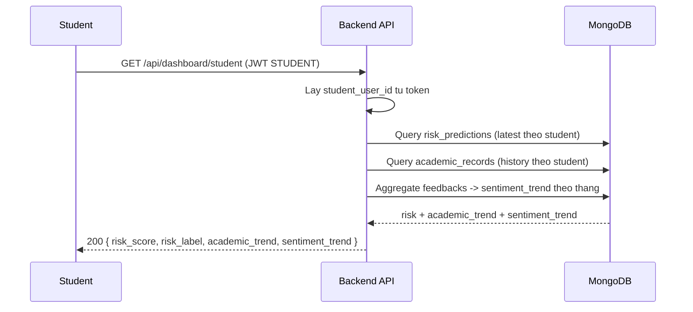
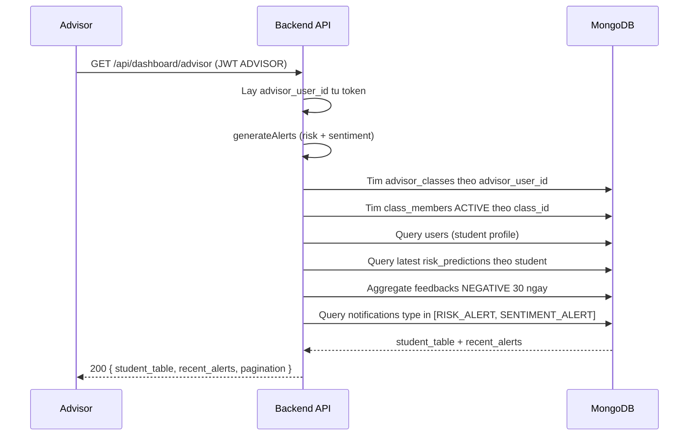

# Dashboard Flow (AI-01 + AI-02)

## 1) Scope
Tai lieu mo ta luong dashboard hien tai:
- `STUDENT`: chi xem dashboard cua chinh minh
- `ADVISOR`: chi xem dashboard cua chinh advisor do
- Chi hien thi du lieu lien quan `risk` va `sentiment` (anomaly tam an)

## 2) Student Dashboard Sequence

## 3) Advisor Dashboard Sequence

## 4) Payload chinh
### 4.1 Student dashboard
- `risk_score`
- `risk_label`
- `academic_trend`
- `sentiment_trend`

### 4.2 Advisor dashboard
- `student_table[]`
  - `student_user_id`, `student_code`, `full_name`, `email`
  - `risk_score`, `risk_label`
  - `alerts.negative_sentiment_30d`
  - `alerts.high_risk`
  - `alert_count` = `negative_sentiment_30d + high_risk`
- `recent_alerts` (chi `RISK_ALERT`, `SENTIMENT_ALERT`)
- `pagination`

## 5) Rule quyen truy cap
- `/api/dashboard/student`: chi role `STUDENT`
- `/api/dashboard/advisor`: chi role `ADVISOR`
- Khong cho override `student_user_id` hoac `advisor_user_id` qua body

