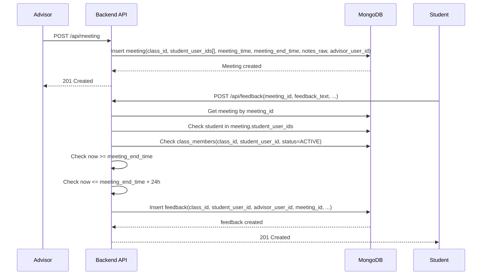

# Meeting-Feedback Flow (Hien tai)

## 1) Muc tieu
Tai lieu nay mo ta luong nghiep vu hien tai cho:
- Advisor tao meeting
- Student gui feedback sau meeting
- Rule rang buoc theo lop/class, participant, va thoi gian

## 2) Thanh phan lien quan
- `advisor_classes`: 1 advisor <-> 1 class
- `class_members`: 1 student <-> 1 class
- `meetings`: 1 advisor + nhieu student trong cung buoi
- `feedbacks`: feedback cua student theo tung meeting

## 3) Sequence luong chinh


## 4) Rule bat buoc
1. Tao meeting:
- `class_id` bat buoc
- `student_user_ids` bat buoc, la mang khong rong
- `meeting_time` bat buoc, phai la ISO date
- `meeting_end_time` bat buoc va phai > `meeting_time`
- `notes_raw` bat buoc, la string va toi thieu 30 ky tu
- Chi role `ADVISOR` duoc tao meeting (`POST /api/meeting`)

2. Gui feedback:
- `meeting_id` bat buoc
- `feedback_text` bat buoc, la string va toi thieu 20 ky tu
- `rating` neu gui thi trong khoang 1-5
- `submitted_at` neu gui thi phai la ISO date
- Student phai nam trong `meeting.student_user_ids`
- Student phai la `ACTIVE` member cua `meeting.class_id`
- Moi student chi gui 1 feedback cho 1 meeting (unique `(meeting_id, student_user_id)`)
- Chi duoc gui sau khi meeting ket thuc va khong qua 24h
- Chi role `STUDENT` duoc gui feedback (`POST /api/feedback`)

**Lưu ý:** sentiment_label và feedback_score được backend tự động gán sau khi gọi AI, client không nhập hai trường này khi gửi feedback.

## 5) Loi nghiep vu co the gap
- `404 meeting not found`: meeting khong ton tai
- `403 student is not in this meeting`: student khong nam trong danh sach tham gia meeting
- `403 student is not an active member of meeting class`: student khong thuoc class hoac khong active
- `409 feedback already submitted for this meeting`: da gui feedback roi
- `422 feedback can only be submitted after meeting ends`: gui som hon meeting_end_time
- `422 feedback must be submitted within 24 hours after meeting ends`: gui tre hon 24h

## 6) Input mau
### 6.1 Tao meeting
```json
{
  "class_id": "65f000000000000000000111",
  "student_user_ids": [
    "65f000000000000000000201",
    "65f000000000000000000202"
  ],
  "term_id": "65f000000000000000000010",
  "meeting_time": "2026-03-26T08:00:00.000Z",
  "meeting_end_time": "2026-03-26T09:00:00.000Z",
  "notes_raw": "Noi dung SHCVHT can mo ta ro cac van de, huong xu ly va ke hoach theo doi."
}
```

### 6.2 Gui feedback
```json
{
  "meeting_id": "65f000000000000000000301",
  "feedback_text": "Buoi SHCVHT huu ich, em mong muon co them huong dan cu the cho ke hoach hoc tap ky toi.",
  "rating": 4
}
```

