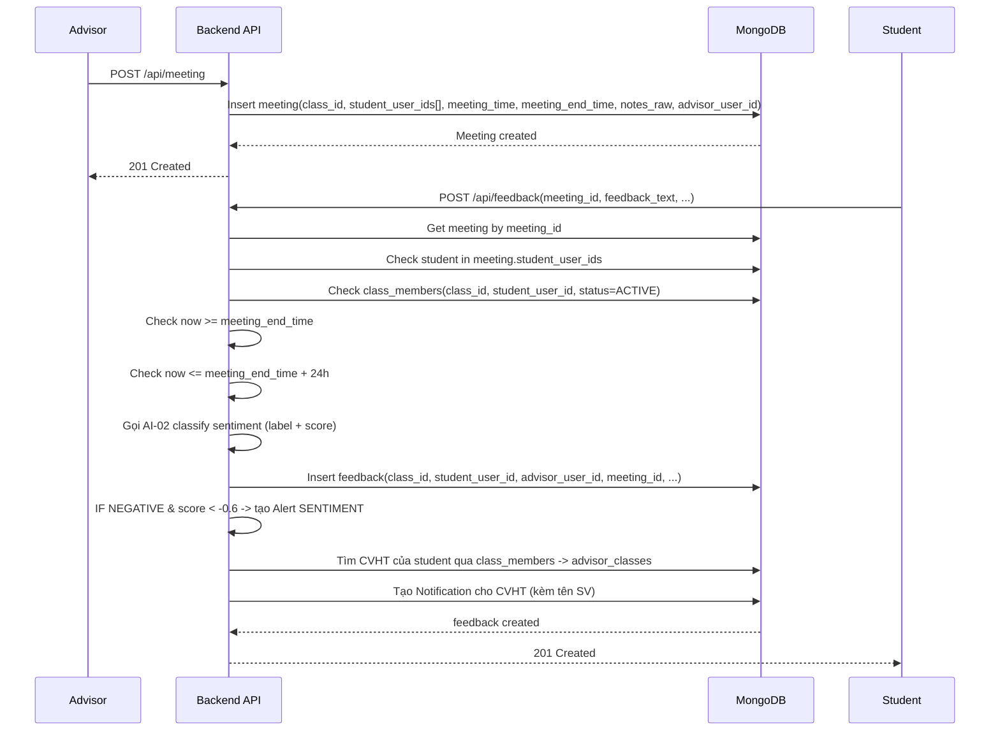

# Meeting-Feedback Flow (Hiện tại)

## 1) Mục tiêu
Tài liệu này mô tả luồng nghiệp vụ hiện tại cho:
- Advisor tạo meeting
- Student gửi feedback sau meeting
- Rule ràng buộc theo lớp/class, participant, và thời gian
- Tự động tạo `alert` + `notification` sentiment khi feedback có dấu hiệu nguy cơ

## 2) Thành phần liên quan
- `advisor_classes`: 1 advisor <-> 1 class
- `class_members`: 1 student <-> 1 class
- `meetings`: 1 advisor + nhiều student trong cùng buổi
- `feedbacks`: feedback của student theo từng meeting

## 3) Sequence luồng chính


## 4) Rule bắt buộc
1. Tạo meeting:
- `class_id` bắt buộc
- `student_user_ids` bắt buộc, là mảng không rỗng
- `meeting_time` bắt buộc, phải là ISO date
- `meeting_end_time` bắt buộc và phải > `meeting_time`
- `notes_raw` bắt buộc, là string và tối thiểu 30 ký tự
- Chỉ role `ADVISOR` được tạo meeting (`POST /api/meeting`)

2. Gửi feedback:
- `meeting_id` bắt buộc
- `feedback_text` bắt buộc, là string và tối thiểu 20 ký tự
- `rating` nếu gửi thì trong khoảng 1-5
- `submitted_at` nếu gửi thì phải là ISO date
- Student phải nằm trong `meeting.student_user_ids`
- Student phải là `ACTIVE` member của `meeting.class_id`
- Mỗi student chỉ gửi 1 feedback cho 1 meeting (unique `(meeting_id, student_user_id)`)
- Chỉ được gửi sau khi meeting kết thúc và không quá 24h
- Chỉ role `STUDENT` được gửi feedback (`POST /api/feedback`)
- Alert sentiment:
  - Điều kiện: `sentiment_label == NEGATIVE` và `feedback_score < -0.6`
  - Severity: `HIGH` nếu `< -0.8`, ngược lại `MEDIUM`
  - Tạo `alert` với `alert_type=SENTIMENT`, `source_ai=AI02_SENTIMENT`, `feedback_id`
  - Tạo `notification` gửi đúng CVHT của lớp sinh viên

**Lưu ý:** sentiment_label và feedback_score được backend tự động gán sau khi gọi AI, client không nhập hai trường này khi gửi feedback.

## 5) Lỗi nghiệp vụ có thể gặp
- `404 meeting not found`: meeting không tồn tại
- `403 student is not in this meeting`: student không nằm trong danh sách tham gia meeting
- `403 student is not an active member of meeting class`: student không thuộc class hoặc không active
- `409 feedback already submitted for this meeting`: đã gửi feedback rồi
- `422 feedback can only be submitted after meeting ends`: gửi sớm hơn meeting_end_time
- `422 feedback must be submitted within 24 hours after meeting ends`: gửi trễ hơn 24h

## 6) Input mẫu
### 6.1 Tạo meeting
```json
{
  "class_id": "65f000000000000000000111",
  "student_user_ids": [
    "65f000000000000000000201",
    "65f000000000000000000202"
  ],
  "term_id": "65f000000000000000000010",
  "meeting_time": "2026-03-26T08:00:00.000Z",
  "meeting_end_time": "2026-03-26T09:00:00.000Z",
  "notes_raw": "Nội dung SHCVHT cần mô tả rõ các vấn đề, hướng xử lý và kế hoạch theo dõi."
}
```

### 6.2 Gửi feedback
```json
{
  "meeting_id": "65f000000000000000000301",
  "feedback_text": "Buổi SHCVHT hữu ích, em mong muốn có thêm hướng dẫn cụ thể cho kế hoạch học tập kỳ tới.",
  "rating": 4
}
```

